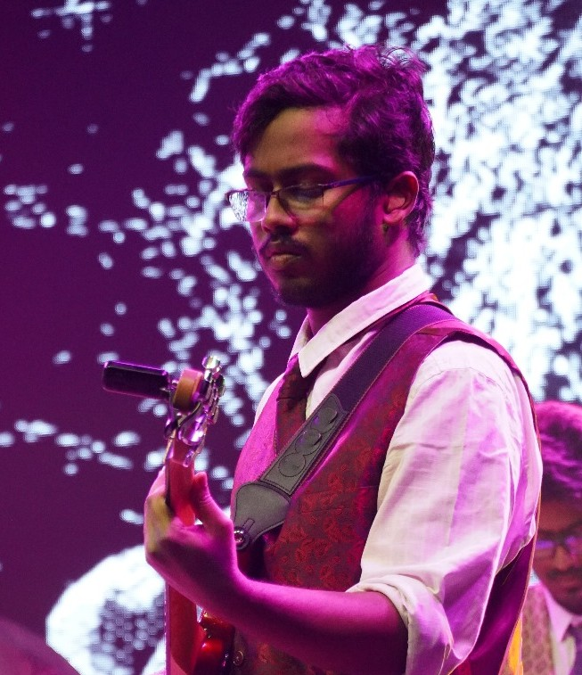
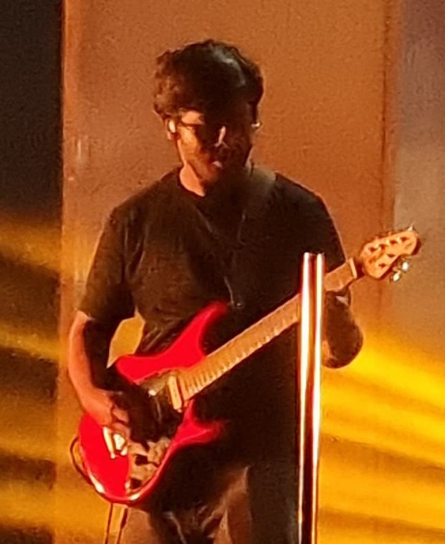
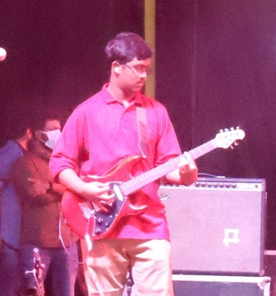
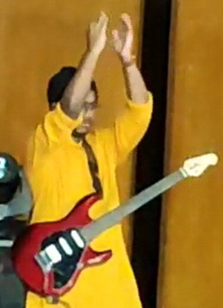

  

    

      

        <video controls poster="../assets/img/cover-2024-12-28.jpg" preload="metadata">
          <source src="../assets/video/2024-12-28.mp4" type="video/mp4">
        </video>
      

      

        
Won Gold at Battle of Bands at Inter IISER Cultural Meet (IICM) 2024 (Rhythmica)

        
December 28, 2024

        
      

    

    

      

        <video controls poster="../assets/img/cover-2024-08-03.jpg">
          <source src="../assets/video/2024-08-03.mp4" type="video/mp4">
        </video>
      

      

        
Performing at Sangam - 2024 (Rhythmica)

        
August 3, 2024

        
      

    

    

      

        <video controls poster="thumb3.jpg">
          <source src="../assets/video/2024-03-23.mp4" type="video/mp4">
        </video>
      

      

        
Performing at Founders Day Show - 2024 (Rhythmica)

        
March 23, 2024

        
      

    

    

      

        <video controls poster="thumb4.jpg">
          <source src="../assets/video/2023-11-18.mp4" type="video/mp4">
        </video>
      

      

        
Performing at Diwali Show - 2023 (Rhythmica)

        
November 18, 2023

        
      

    

    

      

        <video controls poster="thumb5.jpg">
          <source src="../assets/video/2023-10-14.mp4" type="video/mp4">
        </video>
      

      

        
Performing at Rhapsody - 2023 (Rhythmica)

        
October 14, 2023

        
      

    

    

      

        <video controls poster="thumb5.jpg">
          <source src="../assets/video/2023-08-04.mp4" type="video/mp4">
        </video>
      

      

        
First show at IISc - Sangam

        
August 4, 2023

        
      

    

  

  <button class="nav-button prev" onclick="moveCarousel(-1)">❮</button>
  <button class="nav-button next" onclick="moveCarousel(1)">❯</button>

